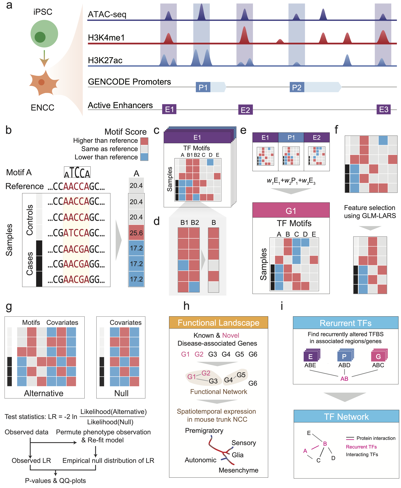

# 

**MARVEL: Multigranular Analysis of Regulatory Variants on the Epigenomic Landscape**.

<!-- [](https://travis-ci.com/fuxialexander/marvel) -->
[](https://www.nextflow.io/)
[](http://bioconda.github.io/)
[](https://hub.docker.com/r/fuxialexander/marvel)

## Introduction
MARVEL is a pipeline for noncoding regulatory variants analysis using whole-genome sequencing data and cell-type specific epigenomic profiles. The workflow of MARVEL can be summarized using the following figure:


Figure 1 Schematic overview of MARVEL. (**a**) Epigenomic data of relevant cell type (hNC in the case of HSCR) are integrated with a gene annotation set to identify the active regulatory elements relevant to the phenotype of interest. (**b**) In each regulatory element, the functional significance of genetic variants is evaluated by their perturbation to TF sequence motifs. (**c**) Since the perturbation effects of multiple genetic variants may not add up linearly, they are considered together to reconstruct the sample-specific sequences, based on which the overall change of TF motif match scores is determined. (**d**) For motifs with multiple appearances within the same regulatory element, their match scores are aggregated to give a single score. (**e**) At a higher level, if a gene involves multiple regulatory elements, the aggregated match scores of a motif in the different elements can be further aggregated into a single score. This is done in the gene-based analysis. (**f-g**) The aggregated match score matrix of all the motifs for a regulatory element/gene is used as the input of an association test, which selects a subset of the most informative motif features (**f**) and compares a model involving both these selected features and the covariates with a null model that involves only the covariates using likelihood ratio (LR) test (**g**). (**h**) The regulatory elements and genes identified to be significantly associated with the phenotype can be further studied by other downstream analyses, such as gene set enrichment and single-cell expression analyses. (**i**) TFs with recurrently perturbed match scores in different regulatory elements are collected to infer a network that highlights the phenotype-associated perturbations. Please notice that **h** and **i** are not included in this repository at the current stage, but can be obtained easily using the result produced by MARVEL and [Cytoscape](https://cytoscape.org/).

The pipeline is built using [Nextflow](https://www.nextflow.io), a workflow tool to run tasks across multiple compute infrastructures in a very portable manner. It comes with docker containers making installation trivial and results highly reproducible.

## Quick Start

i. Install [`nextflow`](https://nf-co.re/usage/installation)
```bash
curl -s https://get.nextflow.io | bash
```
and add it to your path. The reason is the normal release has a bug in conda integration.

ii. Install one of [`docker`](https://docs.docker.com/engine/installation/), [`singularity`](https://www.sylabs.io/guides/3.0/user-guide/) or [`conda`](https://conda.io/miniconda.html)

iii. Clone the repo and test it on a minimal dataset
**Notice: the test.vcf.gz and pheno_covar.txt file were temporarily removed as they were made from real genomics data.**
Basically:
For test.vcf.gz: you can use bcftools to select variants in a small regions to produce a VCF with genotypes of multiple samples
For pheno_covar.txt:
- It's a TSV file
- First column is sample name (in the same order as in the VCF file)
- Second column is y/phenotype in 0, 1 coding
- Third or later columns are covariates (all numeric)

```bash
git clone https://github.com/fuxialexander/marvel.git
cd marvel
nextflow main.nf -profile test,<docker/singularity/conda> -resume
```

iv. Look into nextflow.config and test/test.conf and modify it to start running your own analysis!

<!-- TODO nf-core: Update the default command above used to run the pipeline -->
```bash
nextflow main.nf -profile <docker/singularity/conda> -resume
```

See [usage docs](docs/usage.md) for all of the available options when running the pipeline.

## Documentation

The marvel pipeline comes with documentation about the pipeline, found in the `docs/` directory:

1. [Installation](https://nf-co.re/usage/installation)
2. Pipeline configuration
    * [Local installation](https://nf-co.re/usage/local_installation)
    * [Adding your own system config](https://nf-co.re/usage/adding_own_config)
    * [Reference genomes](https://nf-co.re/usage/reference_genomes)
3. [Running the pipeline](docs/usage.md)
4. [Output and how to interpret the results](docs/output.md)
5. [Troubleshooting](https://nf-co.re/usage/troubleshooting)


## Credits

MARVEL is implemented using a boilerplate created by the nf-core team (https://nf-co.re/).

## Citation

<!-- TODO: to be updated -->
If you use MARVEL for your analysis, please cite it as: 

Alexander Xi Fu*, Kathy Nga-Chu Lui*, Clara Sze-Man Tang, Ray Kit Ng, Frank Pui-Ling Lai, Sin-Ting
Lau, Zhixin Li, Maria-Mercè Gracia-Barcelo, Pak-Chung Sham, Paul Kwang-Hang Tam, Elly Sau-Wai
Ngan and Kevin Y. Yip. Whole-genome analysis of noncoding genetic variations identifies
multigranular regulatory element perturbations associated with Hirschsprung disease. (2020)
(DOI AND JOURNAL TO BE ADDED).
